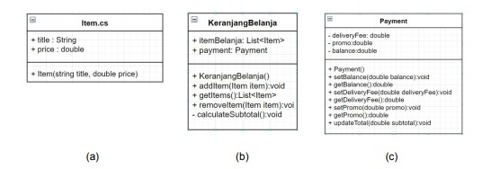
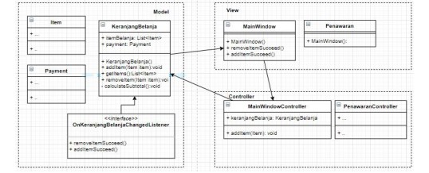

# Ringkasan Pesanan

Aplikasi ini berfungsi untuk meringkas pesanan yang memiliki berbagai fitur yang dibutuhkan oleh marketplace pada umumnya.

## Scope & Functionalities
* User dapat menambah pesanan dengan meng-klik tombol 'tambah'.
* User dapat menambah pesanan melalui jendela `Penawaran.cs`.
* User dapat melihat alamat yang akan dikirim pesanan yang akan dibuat.
* User dapat melihat ongkos kirim.
* User dapat melihat diskon yang ada.
* User dapat melihat total yang harus dibayar untuk pesanan yang telah dibuat.

## How does it works?
MVC adalah salah satu strategi untuk membuat source code kita memenuhi standar Single Responsibility.
Pada aplikasi ini, terdapat beberapa class yang memiliki fungsi sebagai berikut:

* Pada class `Item.cs`, terdapat berbagai item makanan maupun minuman.
* Pada class `KeranjangBelanja.cs`, item-item yang dibeli akan ditampung dalam sebuah wadah keranjang.
* Pada class `Payment.cs`, berfungsi untuk kalkulasi item-item, promo, ongkos kirim dan sebagainya.

Relasi antar class adalah sebagai berikut:

Pada bagian View(direpresentasikan dengan .xaml dan .xaml.cs) bertanggung jawab atas state Button, ListBox, Label dan komponen view lainnya.
Pada bagian ini, sebaiknya tidak menaruh logika perhitungan maupun manipulasi data.
Proses agregasi manipulasi data dapat dikerjakan pada bagian Model.
Contohnya adalah pada class `KeranjangBelanja.cs`, bertanggung jawab untuk menampung koleksi item yang akan dibeli serta melakukan kalkulasi subtotal.
Tidak ada proses klik tombol, refresh listbox maupun operasi-operasi View pada bagian Model.
Apabila bagian model perlu memberi respon kepada View, maka dapat memanfaatkan interface seperti `OnKeranjangBelanjaChangedListener`.

Bagian View juga tidak diperkenankan melakukan _direct access_ ke Model, melainkan melalui perantara Controller.
Pada bagian Controller, diperbolehkan menaruh logika-logika tambahan untuk dikirim ke Model.
Dengan demikian, masing-masing bagian menjalankan peran sesuai kapasitasnya dan tidak saling tumpang tindih tanggung jawab.
